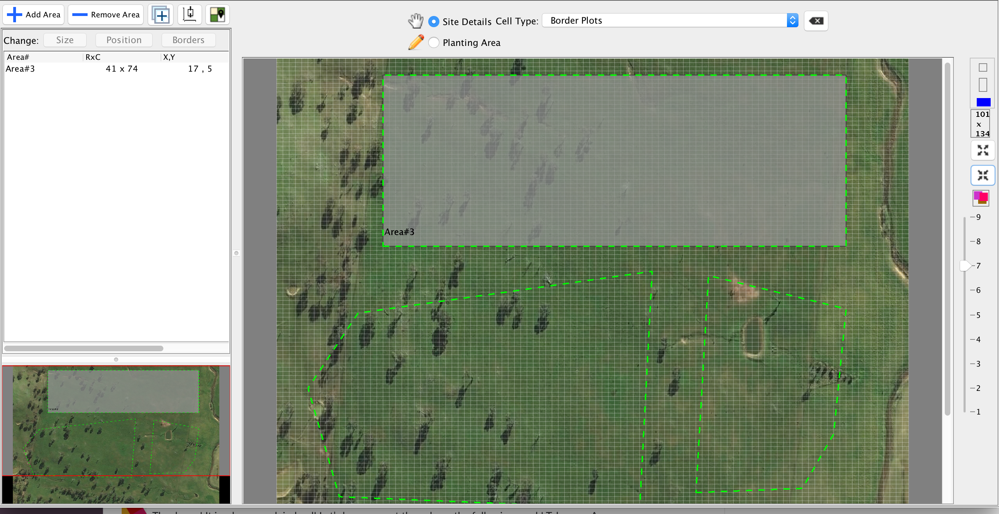

[](https://github.com/dwyl/esta/issues)

# tiny-gis-java
A very small (almost) pure java geographic information system (GIS) library, for manipulating geographic data.
**Useful for Java Swing.**

Based on **geojson-jackson** by **opendatalab** (the only dependencies) for this project.

If you only want to import and export GeoJson in Java please visit the geojson-jackson open datalab repo:
https://github.com/opendatalab-de/geojson-jackson

**WIP Disclaimer**: calculations may not be as accurate over very large distances as more comprehensive libraries.

## What it does
A range of simple manipulation for Geospatial data in Java requiring minimal install and minimal GIS understanding:
- Distance between two Longitude/latitude's (Points)
- Get the bearing between Points
- Calculate a Point given a bearing (e.g. 45 degrees - or NE) and a distance from another Point
- Get the coordinate center of a group of Points/Features
- Rotate Features/Polygons around a center point 
- Import from GeoJson
- Export to GeoJson
- Calculate the intersection of Points/Features with one another
- Project Points/Features onto a grid (useful for showing LngLat polygons in Swing)
- Calculate best fit bearing to render on screen (useful for showing LngLat polygons in Swing)

## Why
It can be difficult to understand some of the larger and more comprehensive geo tooling java libraries. 
Using them requires alot of learning overhead, especially when you want to do simple manipulations of geospatial data.
This is because some of the larger Java libraries have a number sub components, lack modern documentation, require building from source and are not integrated with modern package management tools such as Maven or Gradle.

## Install

**Maven Central coming soon** - Otherwise use the source above in your own project and include the following dependencies:

**Maven**
```xml
<dependency>
 <groupId>de.grundid.opendatalab</groupId>
 <artifactId>geojson-jackson</artifactId>
 <version>1.8.1</version>
</dependency>
```

**Gradle**
```groovy
dependencies {
    // geojson-jackson
    compile 'de.grundid.opendatalab:geojson-jackson:1.8.1'
}
```

## Usage
**Importing GeoJson**
```java
		File file = new File("./geojson.json");
		MapGisGridAnnotationReader reader = new MapGisGridAnnotationReader();
		List<GisGridAnnotation> result = reader.fromGeoJson(file);

		for (GisGridAnnotation ann : result) {
			List<LngLatAlt> LongitudeLatitudeAltitudePoints = ann.getExteriorRing();
		}
```

**Exporting GeoJson**
```java
		MapGisGridAnnotationReader reader = new MapGisGridAnnotationReader();
		List<GisGridAnnotation> result = new ArrayList<>(); // polygons

		String jsonContent = reader.toGeoJson(result);
    		// Now write to file
```

**Basics**
```java
		LngLatAlt a = new LngLatAlt(149.3865874610993, -35.07597449607705);
		LngLatAlt b = new LngLatAlt(149.3876738387109, -35.07607456965434);
		
		// Distance in meters between two points
		Double meters = util.getDistanceBetween(a, b);
		
		// Bearing in degreses between two points
		Double bearing = util.getBearing(a, b);
		
		List<GisGridAnnotation> annotations = new ArrayList<>();
		
		// Two connected points in all of the polygons which have the longest edge
		List<LngLatAlt> largestDistanceBetween = util.getLongestLine(annotations);
		
		// Center point of all polygons/coordinates
		LngLatAlt centerPoint = util.getCenterPoint(annotations);
		
		// Calculating the best field bearing to render the most on screen
		ScaleRotation rotation = util.getBestFieldBearing(annotations);
		Double bestBearing = rotation.bearing;
		//rotation.do180();
		//rotation.do90();
		//...
		
		// Rotating all coordinates/polyongs around a center point so that best bearing is now in line with N
		List<GisGridAnnotation> rotated = util.rotateTo(annotations, rotation, RotationType.NORTH);
```

**Functions for rendering (Java Swing)**
```java
		// The following is particularly helpful for Java Swing transformations and rendering coordinates on screen
		// A reference converter for you grid size to distances in meters and vice versa (USED BELOW)
		WidthHeightProvider widthHeightProvider = new WidthHeightProvider() {

			@Override
			public double getTotalUnitX() {
				// TODO width in meters of a grid cell (or 1 X)
				return 0;
			}

			@Override
			public double getTotalUnitY() {
				// TODO height in meters of a grid cell (or 1 Y)
				return 0;
			}

			@Override
			public double getUnitXForMeters(double meters) {
				// TODO the number of X units for a distance
				return 0;
			}

			@Override
			public double getMetersForUnitX(double x) {
				// TODO distance in meters for a single cell's width (or 1 X) in the grid
				return 0;
			}

			@Override
			public double getUnitYForMeters(double y_distance) {
				// TODO the number of Y units for a distance
				return 0;
			}

			@Override
			public double getMetersForUnitY(double y) {
				// TODO distance in meters for a single cell's height (or 1 Y) in the grid
				return 0;
			}

			@Override
			public int getAdditionalY() {
				// TODO Extra Y spacing from edges
				return 0;
			}

			@Override
			public int getAdditionalX() {
				// TODO Extra X spacing from edges
				return 0;
			}
		};
		
		// Calculate the best grid size for your coordinates/polygons and their bearing
		Dimension gridSize = util.getFieldSizeToUse(annotations, rotation, widthHeightProvider);
		
		// The top left coordinate LngLat of your grid given the grid size, and other parameters
		LngLatAlt topLeftPoint = util.getTopLeftPoint(annotations, gridSize, rotation, widthHeightProvider);
		
		// Transform a grid position to a LngLat
		Point point = new Point(10, 15);
		LngLatAlt transformedPoint = util.transformToLongLat(point, topLeftPoint, gridSize, rotation, widthHeightProvider);
		
		// Transform a LngLatAlt to a grid position
		Point transformedGridPoint = util.transformToXY(a, topLeftPoint, gridSize, rotation, widthHeightProvider);
 ```

### Example Swing Application:


